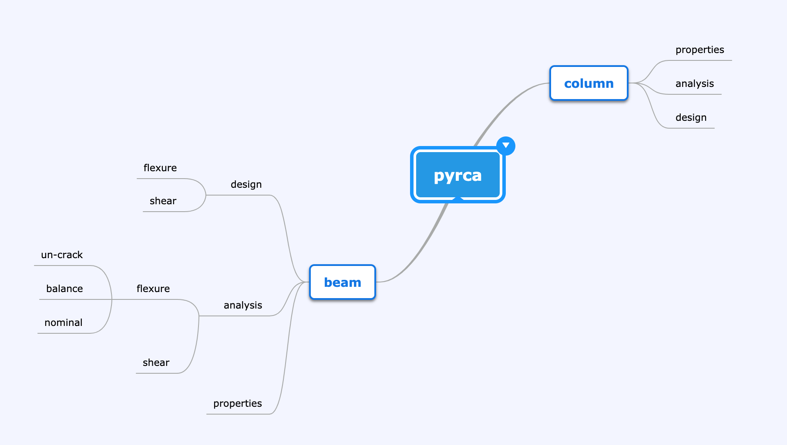

# PyRCA

Python package for analysis of concrete structures.

## Roadmap

#### v0.1.x
- Beam Flexure Capacity Analysis
- Beam Flexure Uncrack Analysis

#### v0.2.x

- Beam Balanced Analysis for flexure

#### v0.3.x (October 1, 2019)

- Beam Shear Analysis

#### v0.4.x (October 3, 2019)

- Beam Design for Flexure

#### v0.5.x (October 4, 2019)

- Beam Design for Shear

#### v0.6.x (October 5, 2019)

- Column Analysis

#### v0.7.x (October 7, 2019)

- Column Interaction

#### v0.8.x (October 8, 2019)

- Column Design

#### v0.9.x

- Corbel Analysis

#### v1.0.x

- Corbel Design
- Report Generation
- Diagrams Generation 

### Mindmap

